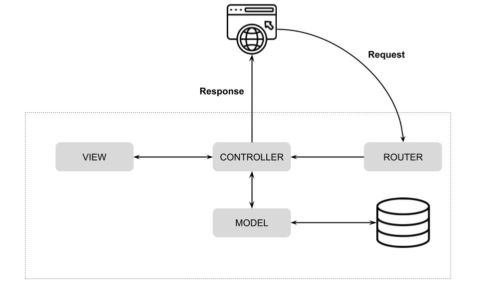

# Aplicación MVC de Gestión de Empleados

Esta es una versión mejorada de la aplicación de gestión de empleados utilizando arquitectura MVC simplificada.

## ¿Qué es MVC?

**MVC (Model-View-Controller)** es un patrón de arquitectura que separa la aplicación en tres componentes principales:

### **Model (Modelo)**
- **Responsabilidad**: Maneja los datos y la lógica de negocio
- **En esta app**: `EmpleadoModel.php` contiene todas las operaciones de base de datos (crear, leer, actualizar, eliminar empleados)
- **Ejemplo**: `EmpleadoModel::getAll()` obtiene todos los empleados de la BD

### **View (Vista)**
- **Responsabilidad**: Presenta la información al usuario (interfaz)
- **En esta app**: Archivos `.php` en la carpeta `views/` que generan el HTML
- **Ejemplo**: `views/empleados/index.php` muestra la lista de empleados

### **Controller (Controlador)**
- **Responsabilidad**: Coordina entre Model y View, maneja las peticiones del usuario
- **En esta app**: `EmpleadoController.php` recibe las acciones y decide qué hacer
- **Ejemplo**: `EmpleadoController::index()` pide datos al modelo y carga la vista

### **Diagrama del patrón MVC:**


Source: https://www.codemag.com/Article/2205071/Building-MVC-Applications-in-PHP-Laravel-Part-1

### **Flujo de la aplicación:**
```
Usuario hace clic → Router → Controller → Model → Controller → View → Usuario ve resultado
```

**Ejemplo práctico:**
1. Usuario hace clic en "Ver empleados" → `index.php?accion=index`
2. **Router** recibe la petición y llama a `EmpleadoController::index()`
3. **Controller** llama a `EmpleadoModel::getAll()` para obtener datos
4. **Model** consulta la base de datos y devuelve los empleados
5. **Controller** pasa los datos a la **Vista** `views/empleados/index.php`
6. **Vista** genera el HTML con la lista de empleados
7. Usuario ve la página con los empleados

## Estructura de carpetas

```
ejercicio3MVC/
├── config/
│   └── config.php              # Configuración de la aplicación
├── models/
│   ├── Database.php            # Clase para conexión a BD
│   └── EmpleadoModel.php       # Modelo de empleados
├── controllers/
│   ├── BaseController.php      # Controlador base
│   └── EmpleadoController.php  # Controlador de empleados
├── views/
│   ├── layout/
│   │   ├── header.php          # Header común
│   │   └── footer.php          # Footer común
│   └── empleados/
│       ├── index.php           # Lista de empleados
│       └── detalle.php         # Detalle de empleado
├── Router.php                  # Router simple
├── index.php                   # Punto de entrada
└── README.md                   # Este archivo
```

## Funcionalidades

- **Listar empleados**: Vista principal con tabla de empleados
- **Buscar empleados**: Filtro por nombre
- **Ver detalle**: Información completa del empleado
- **Crear empleado**: Modal con formulario
- **Eliminar empleado**: Individual o todos
- **Arquitectura MVC**: Separación clara de responsabilidades

## Uso

### URLs disponibles:

- `index.php` - Lista todos los empleados
- `index.php?accion=show&id=1` - Ver detalle del empleado
- `index.php?accion=search&nombre=juan` - Buscar por nombre
- `index.php?accion=store&nombre=...` - Crear empleado
- `index.php?accion=destroy&id=1` - Eliminar empleado
- `index.php?accion=destroyAll` - Eliminar todos

### Para añadir nuevos controladores:

1. Crear `controllers/NuevoController.php`
2. Extender de `BaseController`
3. Usar: `index.php?controller=NuevoController&accion=index`

## Ventajas de esta arquitectura MVC

1. **Separación de responsabilidades**: Modelo, Vista, Controlador
2. **Extensibilidad**: Fácil añadir nuevos controladores
3. **Mantenibilidad**: Código organizado y reutilizable
4. **Simplicidad**: Router simple y directo
5. **Retrocompatibilidad**: Mantiene URLs del sistema anterior